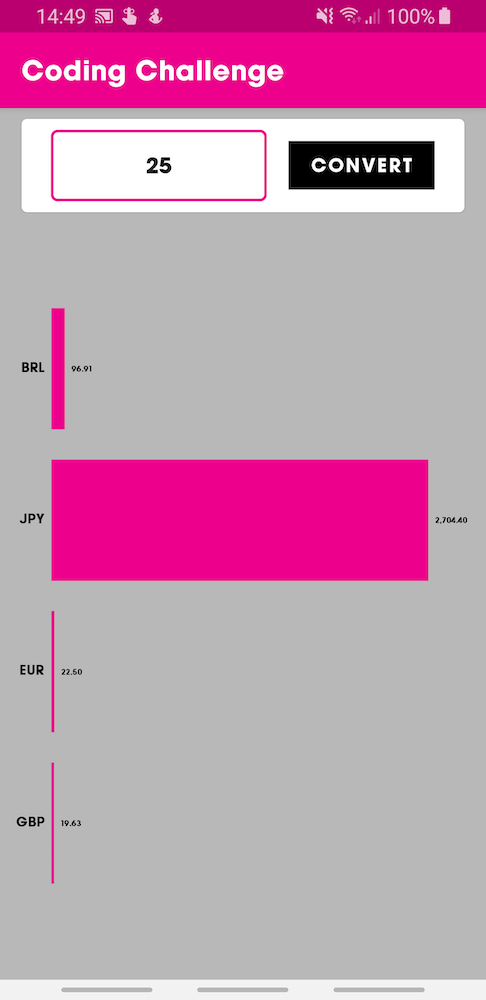

# Mobile Coding Challenge [](https://travis-ci.com/ivannarino/Converter)

An Army of Ones <> Currency Converter

## Getting Started

These instructions will get you a copy of the project up and running on your local machine for development and testing purposes.

### Prerequisites

Android Studio 3.4.1

## Building

In order to build the application, run the following command 

```
./gradlew assemble
```

## Running the tests

For the unit tests, run

```
./gradlew testDebugUnitTest
```

And for the instrumented tests, run

```
./gradlew connectedAndroidTest
```

## Screenshots





## Authors

* **Ivan Nariño Del Castillo** - [About me](https://ivannarino.github.io)


## License

This project is licensed under the MIT License.
